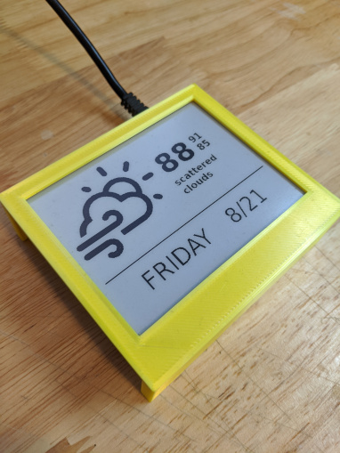

Node.js library for easily creating an ePaper display on a Raspberry Pi using HTML and Javascript.

ePaper.js can be used as:

-   A command line application for **single step rendering of a URL onto an ePaper display**
-   A library that can **interface ePaper displays with custom Node.js applications**

Features include:

-   [Supports multiple ePaper Displays](#supported-hardware)
-   High performance, native c++ hardware access
-   Multiple color modes: black / white, grayscale, black / white / red
-   Dithering for black / white images




## Usage

```
ejs <command> [options] <deviceType>
```

For example, the following command will update the Waveshare 7.5" v2 screen with the contents of `http://localhost:8080` every 10 minutes.

```
ejs refresh rpi-7in5-v2 "http://localhost:8080"
```

For available devices types, see [supported hardware](#supported-hardware). The different [commands](#commands) and suggested [workflows](#workflows) are described below.

### Commands

**Display**: display a single rendition of a URL

```
ejs display [options] <deviceType> <url>
```

| Option               | Description                                                                                            | Allowed Values        |
| -------------------- | ------------------------------------------------------------------------------------------------------ | --------------------- |
| `-o / --orientation` | Use (h)orizontal or (v)ertical orientation                                                             | `[h, v]`              |
| `-c / --colorMode`   | Desired color mode                                                                                     | `[black, 4gray, red]` |
| `--screenshotDelay`  | Wait an additional amount of time after loading the URL before displaying. Useful for client side apps | Time in milliseconds  |
| `--dither`           | Use a dithering algorithm to approximate grayscale / mid-tones on black and white displays             |                       |
| `--username`         | Username for basic authentication                                                                      | username as string    |
| `--password`         | Password for basic authentication                                                                      | password as string    |
| `--debug`            | Print additional log info and stacktraces                                                              |                       |
| `--version`          | Show version number                                                                                    |                       |
| `--help`             | Show help                                                                                              |                       |

**Refresh**: continuously update and display the URL

```
ejs refresh [options] <deviceType> <url>
```

| Option               | Description                                                                                            | Allowed Values                   |
| -------------------- | ------------------------------------------------------------------------------------------------------ | -------------------------------- |
| `-i / --interval`    | Amount of time between refreshes                                                                       | Time in seconds (default 10 min) |
| `-o / --orientation` | Use (h)orizontal or (v)ertical orientation                                                             | `[h, v]`                         |
| `-c / --colorMode`   | Desired color mode                                                                                     | `[black, 4gray, red]`            |
| `--screenshotDelay`  | Wait an additional amount of time after loading the URL before displaying. Useful for client side apps | Time in milliseconds             |
| `--dither`           | Use a dithering algorithm to approximate grayscale / mid-tones on black and white displays             |                                  |
| `--username`         | Username for basic authentication                                                                      | username as string               |
| `--password`         | Password for basic authentication                                                                      | password as string               |
| `--debug`            | Print additional log info and stacktraces                                                              |                                  |
| `--version`          | Show version number                                                                                    |                                  |
| `--help`             | Show help                                                                                              |                                  |

**Clear**: clear the display

```
ejs clear [options] <deviceType>
```

| Option      | Description                               | Allowed Values |
| ----------- | ----------------------------------------- | -------------- |
| `--debug`   | Print additional log info and stacktraces |                |
| `--version` | Show version number                       |                |
| `--help`    | Show help                                 |                |

### Workflows

**Self-Hosting**

-   Create a web app and store it on your Raspberry Pi
-   Host the web app with [http-server](https://www.npmjs.com/package/http-server)
-   Run ePaper.js with `ejs refresh <deviceType> "http://localhost:8080" (or whatever port you configure http-server to run on)`

**Cloud Hosting**

-   Create a web app and host it on a service like [GitHub Pages](https://pages.github.com/) or [Netlify](https://www.netlify.com/)
-   Run ePaper.js with `ejs refresh <deviceType> "<URL of your app>"`

**Running As a Daemon** \
There are several methods of automatically launching ePaper.js on startup and restarting in case of failures

-   Run with [pm2](https://pm2.keymetrics.io/)
-   Create a [systemd service](https://blog.r0b.io/post/running-node-js-as-a-systemd-service/)

### Example Applications

See the examples directory

-   weather-station: This creates an example weather station display
-   color-test: Used to test the various color modes
-   4gray: A demonstration of the 4gray capabilities
-   dithering: A demonstration of the dithering feature

## Supported Software Versions

The following versions are the recommended versions that using during development and testing. Other versions _may work_, but are not officially supported.

-   Node.js: `16 LTS`
-   Raspberry Pi OS: `Bullseye 32 / 64bit`
-   Chromium: `104.0.5112.105`

## Installation

### Raspberry PI

**Enable SPI**

```bash
sudo raspi-config
# Choose Interfacing Options -> SPI -> Yes  to enable SPI interface
sudo reboot
```

**Install Node**
The official recommendation by Node.js is to install Node with a package manager. This helps ensure you'll have the latest LTS version and the proper permissions to install global packages. ePaper.js recommends using [nvm](https://github.com/nvm-sh/nvm)

Raspberry Pi 2, 3, 4 Zero 2:

```bash
curl -o- https://raw.githubusercontent.com/nvm-sh/nvm/v0.39.1/install.sh | bash
source ~/.bashrc
nvm install 16
```

Raspberry Pi 1, Zero:

```bash
curl -o- https://raw.githubusercontent.com/nvm-sh/nvm/v0.39.1/install.sh | bash
source ~/.bashrc
NVM_NODEJS_ORG_MIRROR=https://unofficial-builds.nodejs.org/download/release
nvm install 16
```

**Install Dependencies**

```bash
sudo apt-get update
sudo apt-get install -y build-essential chromium-browser
```

**Install ePaper.js** \
Globally install the `@epaperjs/cli` command line app and the appropriate package for your screen (See [supported hardware](#supported-hardware)).
For example, to install ePaper.js for the Waveshare 7.5" V2 Screen:

```bash
npm install --global @epaperjs/cli @epaperjs/rpi-7in5-v2
```

## Supported Hardware

| Device                                                                          | Device Type    | npm Package              | Color Modes  |
| ------------------------------------------------------------------------------- | -------------- | ------------------------ | ------------ |
| [Waveshare 4.2"](https://www.waveshare.com/4.2inch-e-Paper.htm)                 | `rpi-4in2`     | `@epaperjs/rpi-4in2`     | black 4gray  |
| [Waveshare 7.5" v2](https://www.waveshare.com/7.5inch-e-Paper.htm)              | `rpi-7in5-v2`  | `@epaperjs/rpi-7in5-v2`  | black        |
| [Waveshare 3.7" hat](https://www.waveshare.com/3.7inch-e-paper-hat.htm)         | `rpi-3in7`     | `@epaperjs/rpi-3in7`     | black, 4gray |
| [Waveshare 3.52" hat](https://www.waveshare.com/3.52inch-e-paper-hat.htm)       | `rpi-3in52`    | `@epaperjs/rpi-3in52`    | black        |
| [Waveshare 2.13" hat v2](https://www.waveshare.com/wiki/2.13inch_e-Paper_HAT)   | `rpi-2in13-v2` | `@epaperjs/rpi-2in13-v2` | black, red   |
| [Waveshare 2.13" bc](<https://www.waveshare.com/wiki/2.13inch_e-Paper_HAT_(B)>) | `rpi-2in13-bc` | `@epaperjs/rpi-2in13-bc` | black        |
| [Waveshare 2.7"](https://www.waveshare.com/wiki/2.7inch_e-Paper_HAT)            | `rpi-2in7`     | `@epaperjs/rpi-2in7`     | black        |

### Adding Support For Additional Displays

It's easy to extend ePaper.js to support additional Waveshare devices. Displays from other manufacturers should be possible to support as well, as long as there is a C / C++ driver available.

If you would like to request support for another display, please open an issue with the title 'Add support for <Device Make \ Model>'. If you're a developer and have extended support yourself, put up a pull request!
